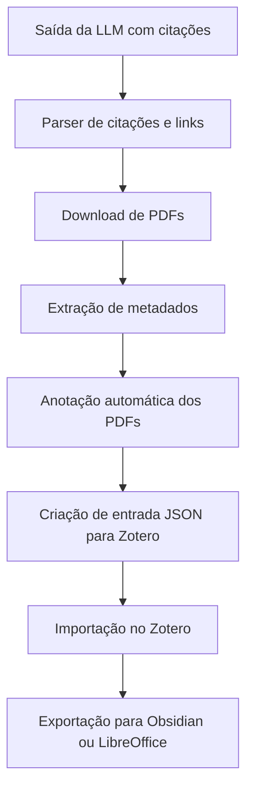

# Fluxo de Trabalho

### Etapas resumidas

1. Coleta da saída da LLM com referências em ABNT.
2. Processamento das citações e links.
3. Download e anotação dos PDFs.
4. Extração de metadados (DOI, autores, etc.).
5. Geração de entradas bibliográficas com os PDFs.
6. Integração Zotero e exportações automáticas.
